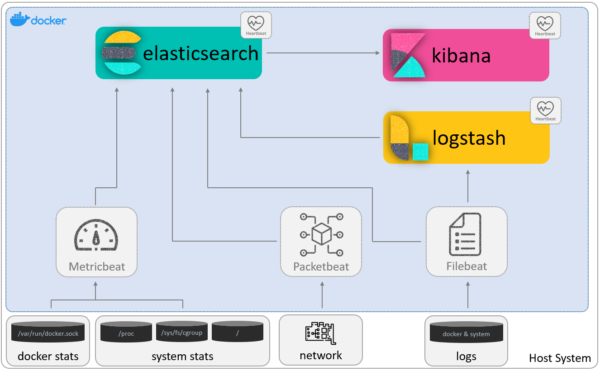

# Elastic Stack Demo

Hello friends! Here are a few examples on how to deploy Elastic Stack using docker. It is part of a series in which by 
using examples, we deploy a series of Beats, Logstash, Elasticsearch and Kibana in a dockerized environment. Hope you
enjoy it. The below image, is a representation of the final architecture.

* [Introduction to Elastic Stack](https://www.canchito-dev.com/public/blog/2021/12/26/introduction-to-elastic-stack/).
* [Deploying Elastic Stack Cluster (single node) in docker](https://www.canchito-dev.com/public/blog/2021/12/26/deploying-elastic-stack-cluster-single-node-in-docker/).
* [Introduction to Elastic Stack Beats](http://www.canchito-dev.com/public/blog/2022/01/02/elastic-stack-beats/)
* [Deploying Filebeat in docker](http://www.canchito-dev.com/public/blog/2021/12/31/deploying-filebeat-in-docker/)
* [Getting Started with Logstash](http://www.canchito-dev.com/public/blog/2022/01/16/getting-started-with-logstash/)